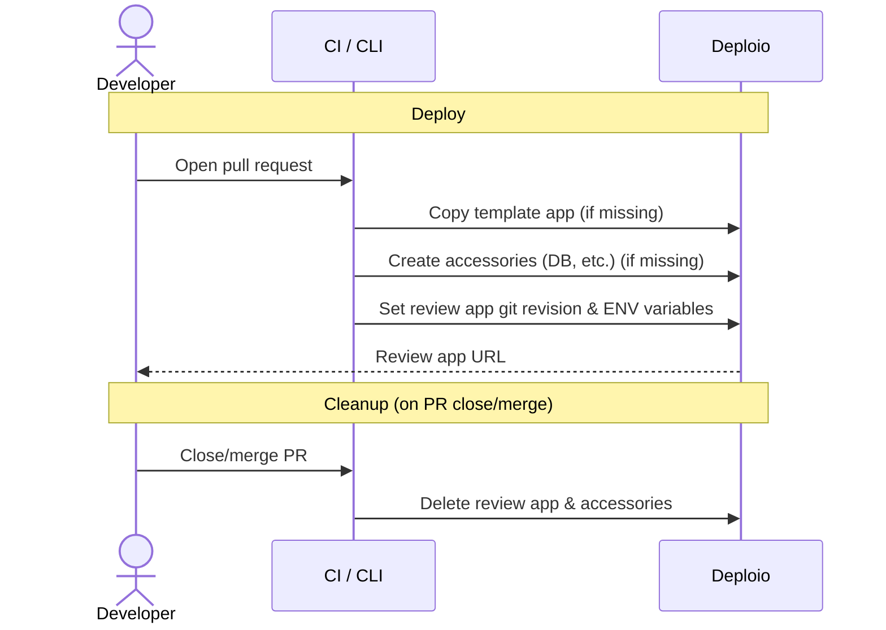

# Deploio Review Apps

Deploy a temporary app per branch on [Deploio](https://deploio.ch).
Automatic deploy on PR open, automatic cleanup on PR close/merge.

Extracted from https://guides.deplo.io/user-guide/ci-cd-integration.html

## Flow



## Setup

### 1. Requirements

- [`nctl`](https://docs.nine.ch/docs/nctl/) CLI installed and authenticated
- A **template app** already deployed on Deploio (your main/production app)
- `jq` available in the CI environment

### 2. Add the scripts

- `bin/deploy_review_app` to copy the template app and to point the new app to your feature branch
- `bin/delete_review_app` to clean up the created review app and it's accessories (DB, Redis, etc.)

I recommend that you consider the scripts as "templates". You can copy them to your project and customize them as you want.
You might want to replace the Postgres commands with MySQL, or create additional Redis services for example.

### 3. Configure GitHub Actions

Set these variables where noted:

| Variable | Where | Description |
|---|---|---|
| `DEPLOIO_PROJECT` | Workflow env + local shell | Deploio project name |
| `DEPLOIO_TEMPLATE_APP` | Workflow env + local shell | Name of the app to copy as template |
| `ENV_FLAGS` | Workflow env + local shell | *(optional)* Additional `--env` flags |
| `NCTL_API_CLIENT_ID` | GitHub secret | nctl API client ID |
| `NCTL_API_CLIENT_SECRET` | GitHub secret | nctl API client secret |
| `NCTL_ORGANIZATION` | GitHub secret | nctl organization name |

### 4. CI integration (GitHub Actions)

Add `.github/workflows/review-app.yml`

### 5. Local usage

```bash
nctl auth login

# Deploy
export DEPLOIO_PROJECT=your-project-name
export DEPLOIO_TEMPLATE_APP=main
bin/deploy_review_app feature/my-branch

# Cleanup
bin/delete_review_app feature/my-branch
```
